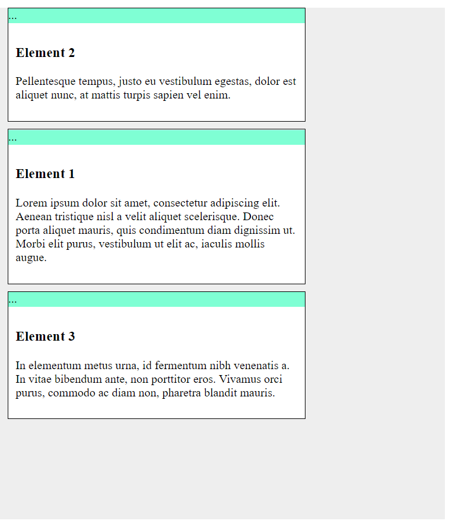
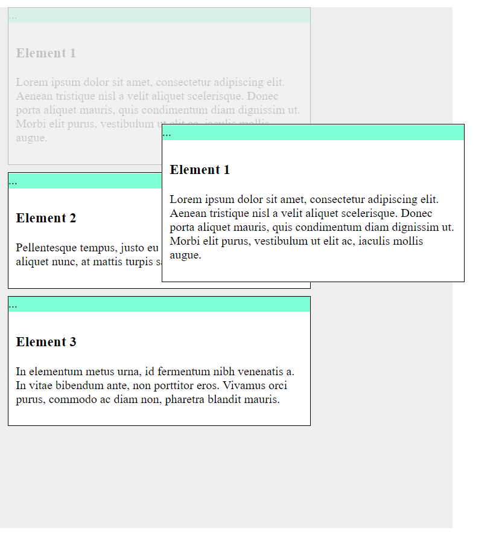

# sg-drag-and-drop-plugin
Javascript plugin to drag and drop list elements

1. Add classes to elements (by default it's "sortable-list", "sortable" and "element-drag")
```
    <div class="sortable-list">
        <div class="sortable">
            <div class="element-drag">...</div>
            <div class="element-content">
                <h3>Element 1</h3>
                <p>Lorem ipsum dolor sit amet.</p>
            </div>
        </div>
        <div class="sortable">
            <div class="element-drag">...</div>
            <div class="element-content">
                <h3>Element 2</h3>
                <p>Pellentesque tempus.</p>
            </div>
        </div>
    </div>
```
2. Init the plugin
```
<script type="text/javascript">
    $(document).ready(function() {
      addSortHandler();
    });
</script>
```

3. Profit.

You can specify your custom classes and use callback on every position changing.



